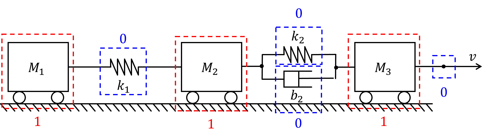

## 6. Bond Graphs

A train of three wagons are being pulled by an ideal speed source according to the figure.

There is a spring and damper between the first and second wagon, and only a spring between the second and the third.

Draw a bond graph of the system.

{::nomarkdown}

<strong>Answer</strong>
{:/nomarkdown}

(there may also be other correct solutions)

{::nomarkdown}
{:/nomarkdown}

{::nomarkdown}

<strong>Solution</strong>
{:/nomarkdown}

First we need to identify the junctions (1 = common speed, 2 = common force):

We then begin drawing the bond graph by adding the junctions:

Then we can add the elements connectec to each junction. The direction of the arrows does not matter, but we assume that all energy flows from the source to all other elements.

We can now simplify the graph by removing junctions with only two connections:

Finally, we need to define causalities, e.g. determine which elements that computes speed and which ones that computes force. See lecture notes for the rules.

This is the final bond graph for the system, which can be used to derive the equation system!

{::nomarkdown}
{:/nomarkdown}
