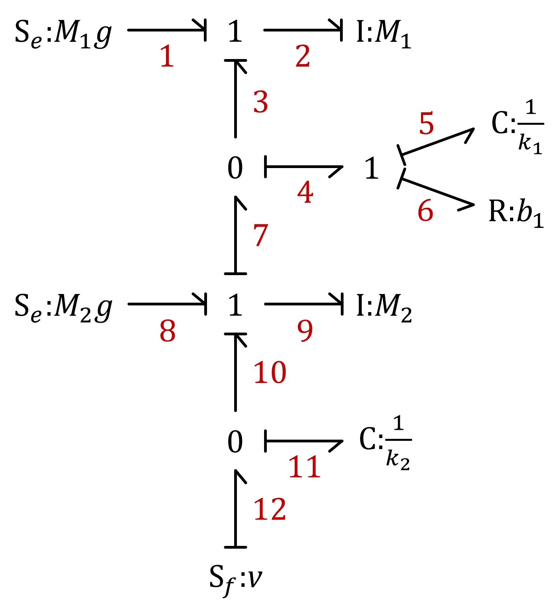

## 1h. Bond Graphs (2)

Consider the following bond graph:

Derive a system of equation from the bond graph. What physical application do you think it represents?

{::nomarkdown}

<strong>Answer</strong>
{:/nomarkdown}

$m_1 \dot{v}_1 + k_1 (x_1+x_2) + b_1 (v_1+v_2) + m_1 g = 0$\
$m_2 \dot{v}_2 + k_1 (x_1+x_2) + b_1 (v_1+v_2) + m_2 g - k_2 (x_2 + x) = 0$\
$v_1 = \dot{x_1}$\
$v_2 = \dot{x_2}$\
$v = \dot{x}$

{::nomarkdown}
{:/nomarkdown}

{::nomarkdown}

<strong>Solution</strong>
{:/nomarkdown}

It appears to be a mechanical system, based on the $C$, $R$, $k$ and $mg$ variables. 

First we need to number the nodes:

Then we start with the four junctions (*"constraint equations"*). Remember: 0-junctions represent *common effort*, while 1-junctiosn represent *common flow*:

$F_1 + F_2 + F_3 = 0$\
$v_1 = v_2 = v_3$\
$F_3 = F_4 = F_7$\
$v_3 + v_4 + v_7 = 0$\
$F_4 + F_5 + F_6 = 0$\
$v_4 = v_5 = v_6$\
$F_7 + F_8 + F_9 + F_{10} = 0$\
$v_7 = v_8 = v_9 = v_{10}$\
$F_{10} = F_{11} = F_{12}$\
$v_{10} + v_{11} + v_{12} = 0$

Then add one equation for each element (*"constitutive equations"*):

$\mathrm{S}_\mathrm{e}\mathrm{:}m_1 g \rightarrow F_1 = m_1 g$

$\mathrm{I}\mathrm{:}m_1 \rightarrow  v_2 = \frac{1}{m_1} \int{F_2} dt$

$\mathrm{C}\mathrm{:}\dfrac{1}{k_1} \rightarrow  F_5 = k_1 \int{v_5} dt$

$\mathrm{R}\mathrm{:}\dfrac{1}{b_1} \rightarrow  F_6 = b_1 v_6$

$\mathrm{S}_\mathrm{e}\mathrm{:}m_2 g \rightarrow F_8 = m_2 g$

$\mathrm{I}\mathrm{:}m_2 \rightarrow  v_9 = \frac{1}{m_2} \int{F_9} dt$

$\mathrm{C}\mathrm{:}\dfrac{1}{k_2} \rightarrow  F_{11} = k_2 \int{v_{11}} dt$

$\mathrm{S}_\mathrm{f}\mathrm{:}v \rightarrow v_{12} = v$

We can finally simplify the system by eliminating redundant varibles. We also rewrite integrals into derivatives and introduce position variables.

$m_1 \dot{v}_1 + k_1 (x_1+x_2) + b_1 (v_1+v_2) + m_1 g = 0$\
$m_2 \dot{v}_2 + k_1 (x_1+x_2) + b_1 (v_1+v_2) + m_2 g - k_2 (x_2 + x) = 0$\
$v_1 = \dot{x_1}$\
$v_2 = \dot{x_2}$\
$v = \dot{x}$

This is a vertial two-mass system with a prescribed motion in one end - most likely a *quarter-car model*, representing the suspension on one wheel of a car.

{::nomarkdown}
{:/nomarkdown}
