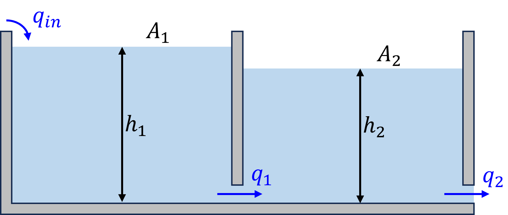

## 2. Order Reduction

Water flows into a tank, which is connected to another tank equipped with an outlet, according to the figure. The connection between the tank and the outlet can be considered restrictors with laminar flow. Assume zero pressure after the outlet. The equations then becomes:

$q_1=K(\rho g h_1 - \rho g h_2)$\
$q_2=K\rho g h_2$\
$\dot{h}\_1=\dfrac{q_{in}-q_1}{A_1}$\
$\dot{h}_2=\dfrac{q_1-q_2}{A_2}$

Under specific circumstances we can assume that $h_1\approx h_2$. \
*Reduce the order of the equation system using projection-based reduction.*

{::nomarkdown}

<strong>Answer</strong>
{:/nomarkdown}

$\dot{z}=-\dfrac{K\rho g}{A_1}z-\dfrac{1}{\sqrt{2}A_1}q_{in}$

{::nomarkdown}

<strong>Solution</strong>
{:/nomarkdown}
We can simplify the system and write it in matrix form:

$\mathbf{E}\begin{bmatrix}\dot{h}\_1 \\\ \dot{h}\_2\end{bmatrix}+\mathbf{A}\begin{bmatrix}h_1\\\h\_2\end{bmatrix}+\mathbf{B}\begin{bmatrix}q\_{in}\end{bmatrix}$

where

$\mathbf{E}= \begin{bmatrix} 1 & 0 \\\ 0 & 1\end{bmatrix}$

$\mathbf{A}= \begin{bmatrix} -\dfrac{K\rho g}{A_1} & \dfrac{K\rho g}{A_2} \\\ \dfrac{K\rho g}{A_2} & -2\dfrac{K\rho g}{A_2}\end{bmatrix}$

$\mathbf{B} = \begin{bmatrix}\dfrac{1}{A_1}\\\0\end{bmatrix}$

Note that $\mathbf{E}$ is not singular, so this is an ODE and not a DAE system. Introduce coordinate reduction matrix $\mathbf{V}$:

$\begin{bmatrix}h_1\\\h_2\end{bmatrix}\approx\mathbf{V}z,\quad \mathbf{V}\in\mathbb{R}^{2\times 1}$

Assuming $h_1\approx h_2 \Rightarrow \mathbf{V}=\dfrac{1}{\sqrt{2}}\begin{bmatrix}1\\\1\end{bmatrix}$

Project original system onto reduced coordinates:

$\mathbf{\hat{E}}=\mathbf{V}^T\mathbf{E}\mathbf{V}, \quad \mathbf{\hat{A}}=\mathbf{V}^T\mathbf{A}\mathbf{V}, \quad  \mathbf{\hat{B}}=\mathbf{V}^T\mathbf{B}\mathbf{V}$

This finally yields:

$\dot{z}=-\dfrac{K\rho g}{A_1}z-\dfrac{1}{\sqrt{2}A_1}q_{in}$

So we have reduced a second order ODE into a first order!

 

