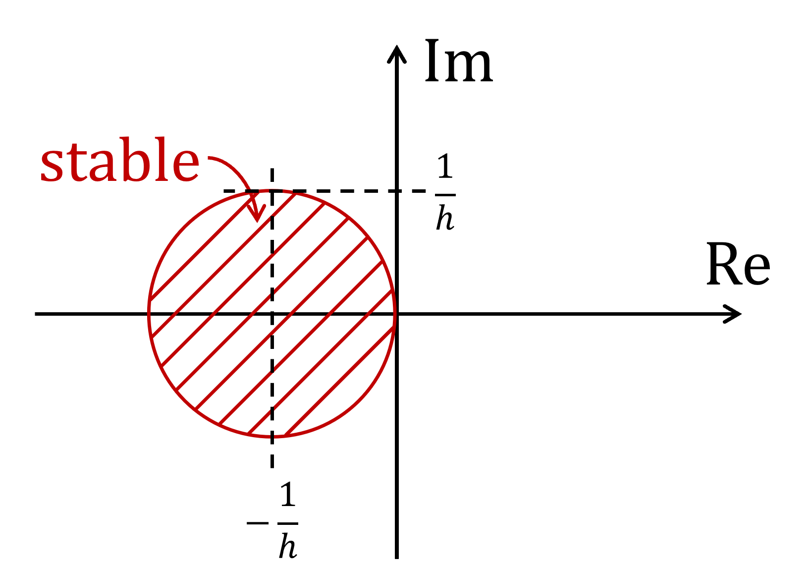
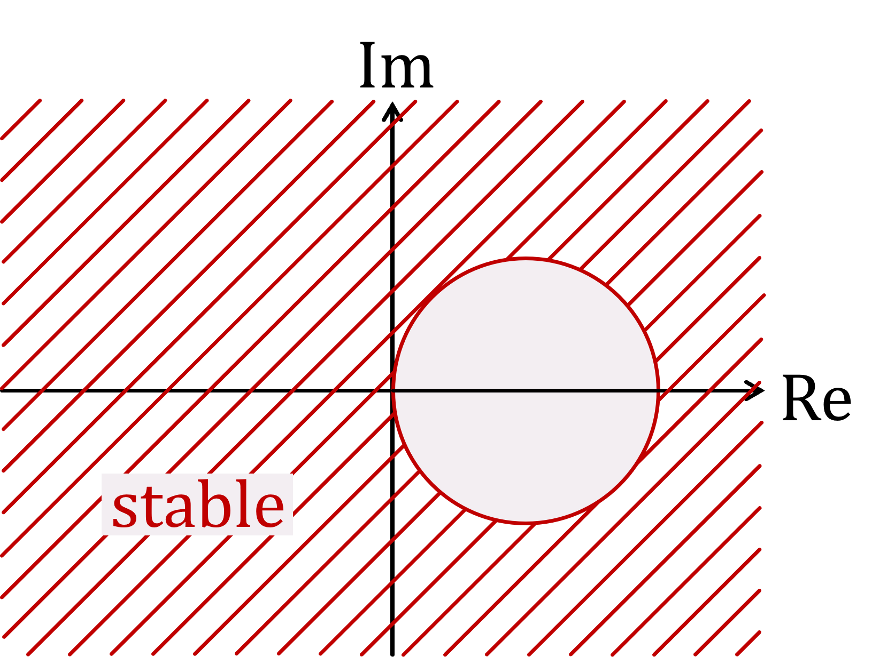

## 8. Stability Region

*Derive* expressions for the stability regions of the forward and backwards Euler methods.

#### Answer

Forward Euler: $\|1+h\lambda\| < 1$

Backwards Euler: $\|1-h\lambda\| > 1$

#### Solution

We will use the stability criterion

$\|\dfrac{x\_{n+1}}{x\_n}\|<1 \quad (1)$

together with Dahlquist test equation

$\dot{x} = \lambda\cdot x \quad (2)$,

where $\lambda$ is a complex number

**Forward Euler:**

$\dot{x}\_n = \dfrac{x\_{n+1}- x\_n}{h} (3)$

(3) in (2) gives:

$\dfrac{x\_{n+1}}{x\_n}=1+h\lambda \quad (4)$

(4) in (1) gives:

$\|1+h\lambda\| < 1$

**Backwards Euler:**

$\dot{x}\_{n+1} = \dfrac{x\_{n+1}- x\_n}{h} (5)$

(5) in (2):

$\dfrac{x\_{n+1}}{x\_n}=\dfrac{1}{1-h\lambda} \quad (4)$

(6) in (1) gives:

$\|1-h\lambda\| > 1$

